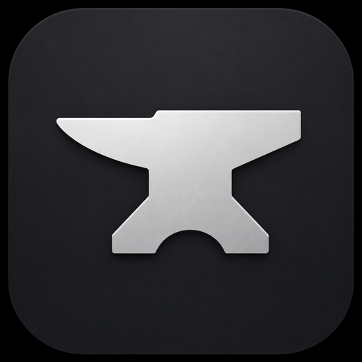

<div align="center">



# Anvil

### The AI-native console for DevOps work

Terminal, editor, git, and your whole ops stack — Kubernetes, Terraform, CI — in
one fast, native macOS window. With an agent that can actually drive it.

[](https://github.com/brzrkr-io/anvil/releases)
[](https://github.com/brzrkr-io/anvil/releases)
[](https://tauri.app)

[**Download**](https://github.com/brzrkr-io/anvil/releases/latest) · [Build from source](#build-from-source)


</div>

---

## Why Anvil

You already live in a terminal, a code editor, a browser tab for CI, and `kubectl`.
Anvil collapses that sprawl into **one window** — and the things that usually
need a context switch are visible at a glance, one keystroke away.

It's built around three loops a platform engineer hits every day:

### 🟢 GitOps reconcile
The Kubernetes / Flux view sorts **broken-first**, shows the failure reason
inline (no hover), auto-refreshes so a reconcile is watched to green, and badges
the failing count right on the rail. One click runs `flux events` for the *why*.

### 🟡 IaC plan → apply
Terraform & Terragrunt discovery is kind-aware (unit / stack / run-all). Plan a
stack once and the result sticks as a **drift badge** (`+3 ~1 -2` / `✓`) on the
list — so you see what has pending changes without re-planning each.

### 🔴 PR + CI triage
Pull requests roll up their CI checks and sort **failing-first** with a status
dot and one-click re-run. A GitHub **Actions** tab lists workflow runs the same
way — red at the top, log and re-run a click away.

### 🤖 The agent drives all three
On any failing resource, hit **Investigate**. The agent runs the right diagnostic,
reads it, and proposes a minimal fix — then, once you approve, re-runs the check
to confirm it's resolved. Every command and edit is **approval-gated**; tool
output is treated as untrusted, so the agent won't act on instructions hidden in
a log. Runs against any local OpenAI-compatible model (e.g. LM Studio).

---

## Also in the box

- **Terminal** — xterm.js + WebGL, ligatures, shell integration (OSC 133/7),
  clickable file paths, splits, search.
- **Editor** — CodeMirror 6 with LSP, multi-file diffs, per-hunk staging, vim mode.
- **Source control** — Terax-style commit panel, swimlane history, and a `gen`
  button that writes your commit message from the staged diff.
- **Native & fast** — real macOS menu bar, multi-window, crash-safe session
  restore, window geometry that persists across relaunches.
- **Yours** — full theming (Mineral palette + custom editor colors), bundled
  coding fonts, global UI scale, credentials in the macOS Keychain (never plaintext).

<div align="center">


</div>

---

## Install

1. Grab the latest `.dmg` from [**Releases**](https://github.com/brzrkr-io/anvil/releases/latest).
2. Open it and drag **Anvil** to Applications.
3. First launch (unsigned build): **right-click → Open**, or:
   ```sh
   xattr -dr com.apple.quarantine /Applications/Anvil.app
   ```

Full power needs the usual tools on your `PATH` (`kubectl`, `flux`, `terraform`,
`gh`, `aws`) and a local model for the agent — but the terminal, editor, and git
work standalone.

## Build from source

Requirements: **Node 20 + pnpm**, **Rust stable**, Xcode command-line tools.

```sh
git clone https://github.com/brzrkr-io/anvil.git
cd anvil
pnpm install
pnpm tauri dev      # run in dev mode (hot reload)
pnpm tauri build    # produce a .dmg in src-tauri/target/release/bundle/dmg/
```

## Tech

Tauri v2 (Rust backend) · SvelteKit SPA (Svelte 5 runes) · xterm.js + WebGL ·
CodeMirror 6. macOS-first.

---

<div align="center">
<sub>Built for people who ship.</sub>
</div>
